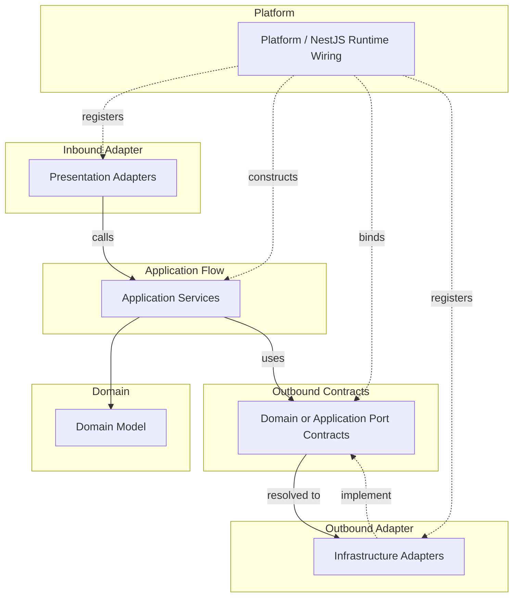

# API Runtime Wiring Convention

Runtime wiring rules decide where objects are created and how implementations are connected to ports.
Runtime wiring MUST NOT weaken source dependency rules.

## Scope

- Use this document when deciding object creation, provider binding, port implementation registration, NestJS DI usage, and runtime configuration ownership.
- Use the source dependency convention when the question is whether one source file may import another.

## Runtime Model

### Runtime Flow And Wiring Map

This map shows runtime flow and provider binding, not source imports.
Solid arrows show runtime call/use direction.
Dotted arrows show provider registration, binding, or implementation.

## Platform

- Keep `src/main.ts` as a thin process entrypoint.
- `platform` contains application startup and runtime wiring code.
- Use `platform/nest` for NestJS root modules, startup functions, global filters, interceptors, guards, pipes, and app-level provider wiring.
- `platform` MAY depend on bounded contexts, adapters, kernels, `core`, frameworks, and external runtime libraries.
- `platform` MUST NOT contain business rules.
- Production code outside `platform` MUST NOT import `platform`, except the thin `src/main.ts` entrypoint.

## Environment Configuration

- Environment variable definitions belong to the boundary that uses them.
- `PORT` belongs to the process entrypoint.
- `SESSION_TTL_MS` and `SESSION_CLEANUP_INTERVAL_MS` belong to the session cleanup infrastructure adapter.
- `CLAUDE_TIMEOUT_MS` belongs to the Claude CLI infrastructure adapter.
- `HEARTBEAT_INTERVAL_MS` and `SYNC_TIMEOUT_MS` belong to prompt execution flow.
- Defaults should stay close to the boundary that owns the runtime value until the project introduces a typed configuration layer.
- Production code should avoid reading unrelated environment variables outside the owning boundary.

## NestJS DI

- NestJS DI MAY be used pragmatically as runtime wiring in `platform/nest`, presentation adapters, infrastructure adapters, and application services.
- NestJS DI MUST NOT create a source dependency from domain code to NestJS.
- Application services MAY use narrow DI metadata such as `@Injectable()`, `@Inject()`, and provider tokens for constructor injection.
- Keep provider registration and module composition in `platform/nest` or bounded context root modules instead of scattering module wiring through application code.
- Application services SHOULD remain instantiable as plain TypeScript classes constructed from explicit dependencies.
- Do not make application behavior depend on NestJS request objects, module references, container lookups, lifecycle callbacks, or other framework runtime APIs.
- Bounded context root modules MAY compose that context's application, presentation, and infrastructure providers.
- Prefer composing providers by bounded context or runtime boundary instead of mirroring every service folder as a NestJS module.

## Port Binding

- In this convention, `port` means a boundary contract owned by an inner layer by default.
- A port is not just any interface, error type, DTO, mapper, or shared contract.
- Use `port` as an architecture term, but do not add a `Port` suffix to contract type names. Name the contract by the capability it represents.
- Runtime wiring MAY connect outer implementations to inner ports without making the inner source file import the outer implementation.
- Infrastructure adapters may implement domain or application ports.
- Bounded context root modules register which implementation satisfies each port.
- Use symbol provider tokens from `*.di-tokens.ts` when the runtime binding should be decoupled from the implementation class.
- Do not use runtime wiring as a reason to add forbidden imports to domain or application core.

## Non-Port Contracts

- Presentation DTOs and mappers are protocol adapter contracts, not ports.
- Presentation error response envelopes are protocol adapter contracts, not ports.
- Infrastructure exceptions and adapter mappers are adapter concerns, not ports.
- If an outer layer contract must be consumed by application core, move the contract inward and model it as an application port or application-kernel contract.
