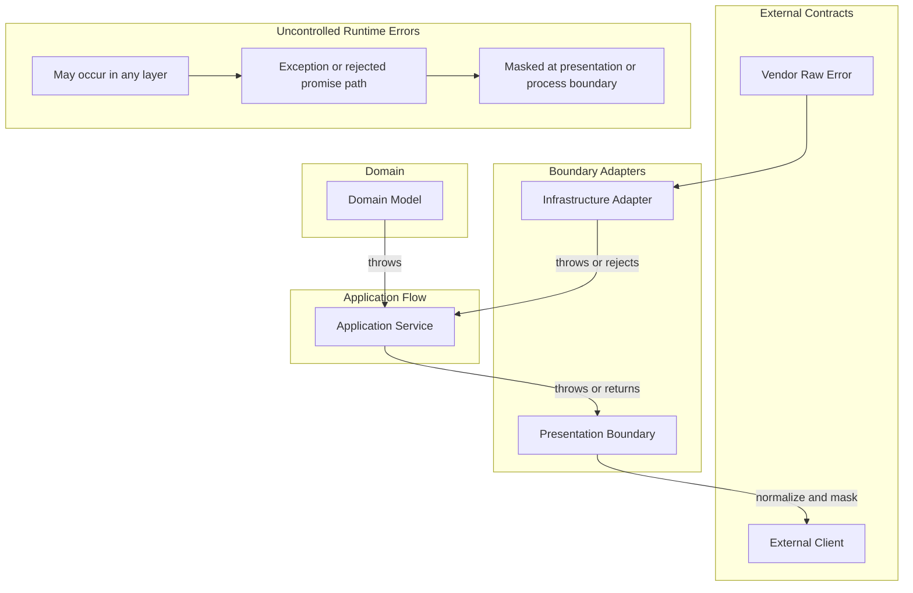

# API 에러 정책

Error는 API control flow와 external contract의 일부다.

## 적용 범위

- Error가 무엇을 의미하는지, 누가 소유하는지, 언제 변환되는지, 어떤 정보를 노출할 수 있는지 결정할 때 이 문서를 사용한다.
- 이 정책은 thrown exception, rejected promise, vendor raw error, unexpected system error, protocol-facing error response를 다룬다.

## 에러 소유권

### Exception And Response Channels

이 프로젝트는 exception을 기본 error channel로 사용한다.
Structured response envelope은 protocol-facing boundary에서만 사용한다.

- Thrown error, exception, rejected promise는 interrupted control flow다. Domain invariant failure, technical adapter failure, operational failure, programming error에 사용한다.
- Request validation은 presentation boundary에서 처리하며 structured response body를 가진 protocol exception을 throw할 수 있다.
- Caller는 recover하거나, boundary context를 추가하거나, protocol response로 변환할 수 있을 때만 exception을 catch하는 것이 좋다.
- Application service는 보통 infrastructure, domain, system exception을 그대로 전파한다.
- `Result`/failure-family contract를 기본으로 추가하지 않는다. Caller에게 안정적이고 유용한 branching behavior가 있고 exception propagation보다 더 명확할 때만 returned failure contract를 도입한다.
- Domain constructor와 factory는 invariant를 guard하기 위해 throw한다. Boundary가 명시적으로 변환하지 않는 한 thrown invariant failure는 bug, corrupted persisted state, insufficient boundary validation으로 본다.

### Error Shape Contracts

Structured error shape는 그것을 전달하는 channel과 독립적인 data contract로 정의한다.

- 각 kernel layer는 `error.base.ts`에 error shape를 정의한다.
- Error shape는 `kind`, `code`, `message`, `details`를 가진다. `kind`는 failure를 분류하고, `code`는 caller와 machine이 안정적으로 식별하는 값이다.
- 같은 error shape는 미래 contract가 필요하다면 exception channel이나 result channel로 전달될 수 있다. Channel은 data shape가 아니라 caller가 failure에 branch해야 하는지로 선택한다.
- Layer-specific exception wrapper(`DomainException`, `ApplicationException`, `InfrastructureException`, `PresentationException`)는 `error` property에 error shape를 담는다. Boundary가 식별하고 변환해야 하는 structured error를 throw할 때 사용한다.
- HTTP presentation boundary는 알려진 application과 presentation error kind를 HTTP status code로 mapping한다. Protocol contract가 명시적으로 변환을 소유하지 않는 한 domain과 infrastructure error는 masking한다.

### Error Owners

Error는 의미를 소유하는 boundary로 분류한다:

- Domain error: transport, framework, process, SDK detail이 없는 business invariant와 domain model guard failure.
- Application error: 특정 external adapter나 protocol이 소유하지 않는 use case와 orchestration failure.
- Infrastructure error: CLI process, SDK, HTTP client, file system, message broker, persistence failure를 포함한 technical adapter failure.
- Presentation error: HTTP validation response 같은 protocol-facing exception과 response body.
- Vendor raw error: application code가 wrap 또는 mask하기 전의 external adapter, SDK, child process, HTTP client, framework failure.
- System error: normal application contract로 처리할 수 없는 unexpected runtime, process, network, OS, resource, environment failure.

Logging은 observability를 도울 수 있지만, logging만으로는 error handling이 아니다.

## 변환 경계

Error owner, audience, exposure policy가 바뀌는 boundary를 지날 때 error를 변환한다.

- Adapter boundary는 adapter context를 추가할 때 vendor raw error를 `cause`가 있는 일반 `Error`로 감쌀 수 있다.
- Infrastructure dependency가 실패했다는 이유만으로 use case가 infrastructure exception을 변환하지 않는다.
- Protocol boundary는 알려진 protocol exception을 변환하고, 인식하지 못한 exception은 external client에 노출하기 전에 masking한다.
- 독립적인 bounded context나 module은 해당 boundary가 사용하는 communication contract를 통해 error를 변환한다.
- Presentation boundary는 domain, infrastructure, vendor, system, unknown error를 external client에 노출하기 전에 masking해야 한다.

Call stack이 내부 folder boundary를 넘었다는 이유만으로 error를 wrap하지 않는다.
Information hiding, ownership, observability, caller behavior를 개선할 때 변환을 선호한다.

## 에러 흐름

## Protocol Error Response Shape

Protocol-facing error response는 stable envelope을 사용하는 것이 좋다.
HTTP response는 해당 protocol이 다르게 해야 할 이유가 없다면 `kernels/presentation`의 `HttpErrorEnvelope`을 사용한다.

- `statusCode`: numeric protocol status.
- `code`: 사람이든 machine이든 response를 분류하기 위한 stable value. Caller는 `message` parsing보다 `code`에 의존해야 한다.
- `message`: presentation 또는 debugging을 위한 human-readable context. 변경, localization, masking, rewrite될 수 있다. Program code는 정확한 `message` text에 의존하면 안 된다.
- `details`: caller behavior 또는 machine processing을 위한 최소 structured data. Response contract의 일부가 되므로 receiver가 의존해도 되는 data만 포함한다.

Validation response는 caller가 조치할 수 있다면 field-level details를 포함할 수 있다.
Protocol contract가 명시적으로 허용하지 않는 한 internal diagnostic data를 protocol response로 노출하지 않는다.

## Vendor Error Contracts

Vendor raw error는 external contract다.
Adapter code가 vendor error의 structured field를 읽는다면, error를 wrap 또는 translate하기 전에 adapter boundary에서 그 field를 validate하고 normalize한다.

- SDK error code, process exit metadata, HTTP client response metadata처럼 adapter가 structured vendor field에 의존할 때는 external error contract에 `zod` schema를 선호한다.
- External enum-like code set은 한 번 `as const` object로 정의하고, 그 object에서 `zod` enum schema를 만들며, schema에서 `z.infer`로 TypeScript type을 파생한다.
- 같은 external code set에 대해 TypeScript enum 또는 union과 별도 `zod` enum list를 따로 유지하지 않는다.
- Vendor error에는 adapter가 소유하지 않는 field가 포함될 수 있으므로 unknown vendor metadata를 허용하고, application contract에 필요한 field만 normalize한다.

## 예상치 못한 시스템 에러

Application은 가능한 모든 thrown value나 rejected promise를 알거나 처리할 수 없다.
Boundary에서는 명시적으로 이해하는 error만 보존하고, 인식하지 못한 error는 application 밖으로 노출하기 전에 masking한다.

- External caller가 protocol contract의 일부로 처리할 수 있을 때만 recognized technical failure를 explicit protocol response로 변환한다.
- Unrecognized failure는 presentation 또는 process boundary가 safe internal response로 masking할 때까지 exception 또는 rejected-promise path에 둔다.
- 내부 observability를 위해 가능하면 original cause를 보존한다.
- Logging, metric, tracing 또는 다른 operational signal로 unrecognized failure를 관찰 가능하게 만든다.
- Unknown failure를 처리하거나 관찰 가능하게 만들지 않은 채 삼켜 silent failure를 만들지 않는다.

Application 밖으로 보내는 unexpected system error response는 stable, safe, masked 상태여야 한다.
