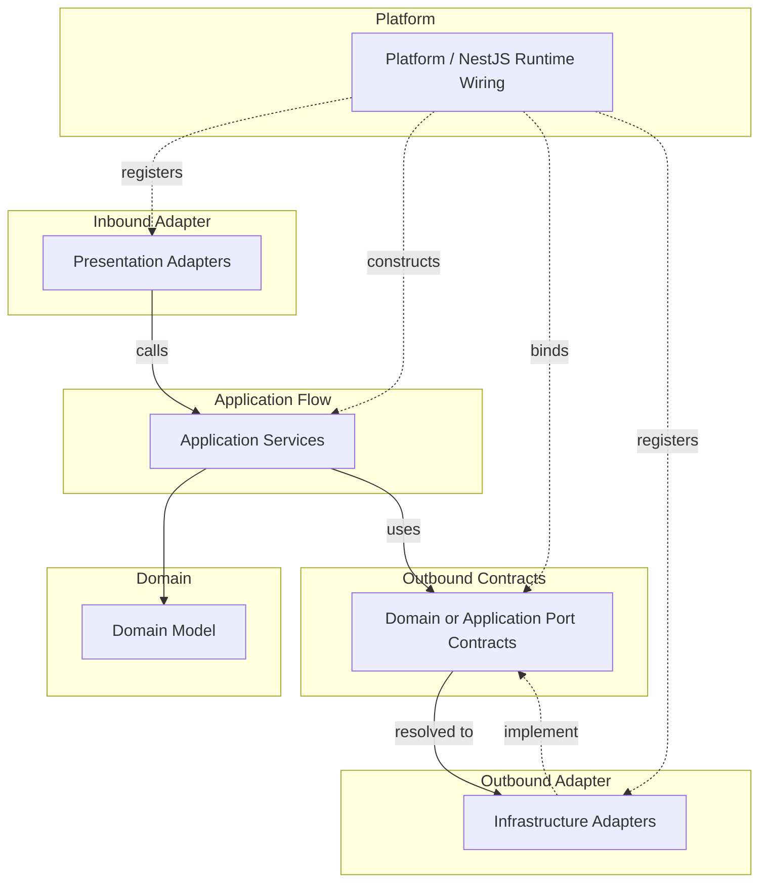

# API 런타임 와이어링 컨벤션

Runtime wiring rule은 object가 어디에서 생성되고 implementation이 port에 어떻게 연결되는지 결정한다.
Runtime wiring은 source dependency rule을 약화시키면 안 된다.

## 적용 범위

- Object creation, provider binding, port implementation registration, NestJS DI usage, runtime configuration ownership을 결정할 때 이 문서를 사용한다.
- 한 source file이 다른 source file을 import할 수 있는지가 질문이라면 source dependency convention을 사용한다.

## 런타임 모델

### 런타임 흐름과 와이어링 지도

이 map은 runtime flow와 provider binding을 보여주며 source import를 의미하지 않는다.
실선 화살표는 runtime call/use direction을 나타낸다.
점선 화살표는 provider registration, binding, implementation을 나타낸다.

## Platform

- `src/main.ts`는 얇은 process entrypoint로 유지한다.
- `platform`은 application startup과 runtime wiring code를 담는다.
- `platform/nest`는 NestJS root module, startup function, global filter, interceptor, guard, pipe, app-level provider wiring에 사용한다.
- `platform`은 bounded context, adapter, kernel, `core`, framework, external runtime library에 의존할 수 있다.
- `platform`은 business rule을 담으면 안 된다.
- `src/main.ts`의 얇은 entrypoint를 제외하고, `platform` 밖 production code는 `platform`을 import하면 안 된다.

## 환경 설정

- Environment variable definition은 그 값을 사용하는 boundary에 속한다.
- `PORT`는 process entrypoint에 속한다.
- `SESSION_TTL_MS`와 `SESSION_CLEANUP_INTERVAL_MS`는 session cleanup infrastructure adapter에 속한다.
- `CLAUDE_TIMEOUT_MS`는 Claude CLI infrastructure adapter에 속한다.
- `HEARTBEAT_INTERVAL_MS`와 `SYNC_TIMEOUT_MS`는 prompt execution flow에 속한다.
- Typed configuration layer가 도입되기 전까지 default는 runtime value를 소유한 boundary 가까이에 둔다.
- Production code는 owning boundary 밖에서 관련 없는 environment variable을 읽지 않는 것이 좋다.

## NestJS DI

- NestJS DI는 `platform/nest`, presentation adapter, infrastructure adapter, application service에서 runtime wiring으로 실용적으로 사용할 수 있다.
- NestJS DI가 domain code에서 NestJS로 향하는 source dependency를 만들면 안 된다.
- Application service는 constructor injection을 위한 `@Injectable()`, `@Inject()`, provider token 같은 좁은 DI metadata를 사용할 수 있다.
- Provider registration과 module composition은 application code 곳곳에 흩어두지 말고 `platform/nest` 또는 bounded context root module에 둔다.
- Application service는 명시적 dependency로 구성되는 plain TypeScript class로 test에서 생성할 수 있는 상태를 유지하는 것이 좋다.
- Application behavior가 NestJS request object, module reference, container lookup, lifecycle callback, 기타 framework runtime API에 의존하게 만들지 않는다.
- Bounded context root module은 해당 context의 application, presentation, infrastructure provider를 조립할 수 있다.
- 모든 service folder를 NestJS module로 그대로 미러링하기보다 bounded context 또는 runtime boundary 기준으로 provider를 조립하는 것을 선호한다.

## Port Binding

- 이 컨벤션에서 `port`는 기본적으로 inner layer가 소유한 boundary contract를 뜻한다.
- Port는 아무 interface, error type, DTO, mapper, shared contract를 뜻하지 않는다.
- `port`는 architecture term으로 사용하되 contract type name에 `Port` suffix를 붙이지 않는다. Contract가 나타내는 capability로 이름을 붙인다.
- Runtime wiring은 inner source file이 outer implementation을 import하지 않게 하면서 outer implementation을 inner port에 연결할 수 있다.
- Infrastructure adapter는 domain 또는 application port를 구현할 수 있다.
- Bounded context root module은 어떤 implementation이 각 port를 만족하는지 등록한다.
- Runtime binding을 implementation class와 분리해야 할 때는 `*.di-tokens.ts`의 symbol provider token을 사용한다.
- Runtime wiring을 이유로 domain 또는 application core에 금지된 import를 추가하면 안 된다.

## Non-Port Contracts

- Presentation DTO와 mapper는 protocol adapter contract이며 port가 아니다.
- Presentation error response envelope은 protocol adapter contract이며 port가 아니다.
- Infrastructure exception과 adapter mapper는 adapter concern이며 port가 아니다.
- Outer layer contract를 application core가 소비해야 한다면 contract를 안쪽으로 옮기고 application port 또는 application-kernel contract로 모델링한다.
